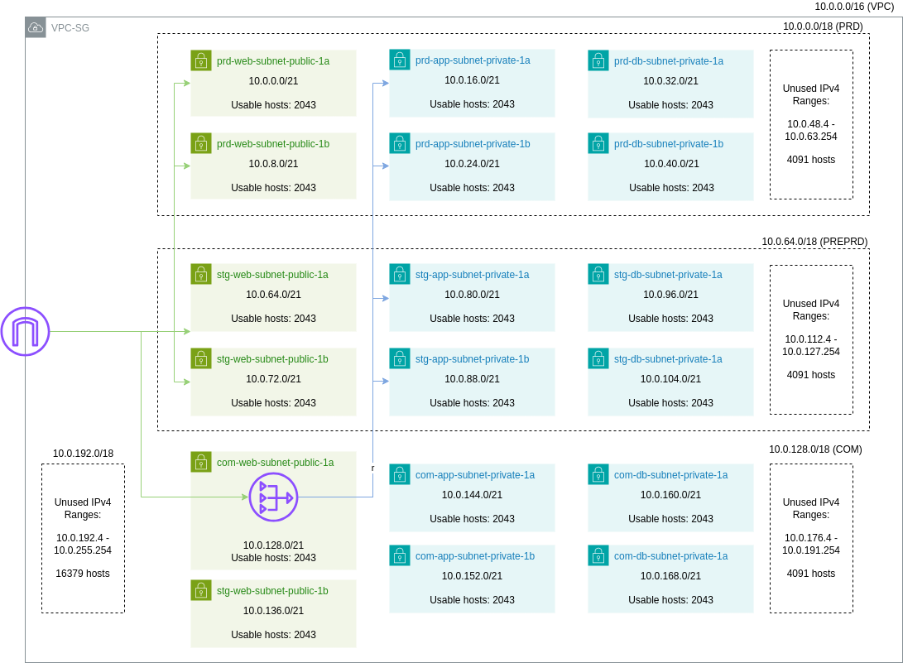

## VPC Architecture

## Requirements

| Name | Version |
|------|---------|
|  [terraform](#requirement\_terraform) | >=1.4.2 |
|  [aws](#requirement\_aws) | ~>5.31.0 |

## Providers

| Name | Version |
|------|---------|
|  [aws](#provider\_aws) | ~>5.31.0 |

## Modules

No modules.

## Resources

| Name | Type |
|------|------|
| [aws_ec2_instance_connect_endpoint.instance_connect](https://registry.terraform.io/providers/hashicorp/aws/latest/docs/resources/ec2_instance_connect_endpoint) | resource |
| [aws_instance.nat](https://registry.terraform.io/providers/hashicorp/aws/latest/docs/resources/instance) | resource |
| [aws_internet_gateway.igw](https://registry.terraform.io/providers/hashicorp/aws/latest/docs/resources/internet_gateway) | resource |
| [aws_main_route_table_association.default](https://registry.terraform.io/providers/hashicorp/aws/latest/docs/resources/main_route_table_association) | resource |
| [aws_route_table.app](https://registry.terraform.io/providers/hashicorp/aws/latest/docs/resources/route_table) | resource |
| [aws_route_table.db](https://registry.terraform.io/providers/hashicorp/aws/latest/docs/resources/route_table) | resource |
| [aws_route_table.web](https://registry.terraform.io/providers/hashicorp/aws/latest/docs/resources/route_table) | resource |
| [aws_route_table_association.app](https://registry.terraform.io/providers/hashicorp/aws/latest/docs/resources/route_table_association) | resource |
| [aws_route_table_association.db](https://registry.terraform.io/providers/hashicorp/aws/latest/docs/resources/route_table_association) | resource |
| [aws_route_table_association.web](https://registry.terraform.io/providers/hashicorp/aws/latest/docs/resources/route_table_association) | resource |
| [aws_security_group.allow_nat_instance](https://registry.terraform.io/providers/hashicorp/aws/latest/docs/resources/security_group) | resource |
| [aws_security_group.nat_instance](https://registry.terraform.io/providers/hashicorp/aws/latest/docs/resources/security_group) | resource |
| [aws_ssm_parameter.allow_nat_security_group](https://registry.terraform.io/providers/hashicorp/aws/latest/docs/resources/ssm_parameter) | resource |
| [aws_ssm_parameter.app_subnets](https://registry.terraform.io/providers/hashicorp/aws/latest/docs/resources/ssm_parameter) | resource |
| [aws_ssm_parameter.db_subnets](https://registry.terraform.io/providers/hashicorp/aws/latest/docs/resources/ssm_parameter) | resource |
| [aws_ssm_parameter.internal_dns_id](https://registry.terraform.io/providers/hashicorp/aws/latest/docs/resources/ssm_parameter) | resource |
| [aws_ssm_parameter.internal_dns_name](https://registry.terraform.io/providers/hashicorp/aws/latest/docs/resources/ssm_parameter) | resource |
| [aws_ssm_parameter.vpc_cidr](https://registry.terraform.io/providers/hashicorp/aws/latest/docs/resources/ssm_parameter) | resource |
| [aws_ssm_parameter.vpc_id](https://registry.terraform.io/providers/hashicorp/aws/latest/docs/resources/ssm_parameter) | resource |
| [aws_ssm_parameter.web_subnets](https://registry.terraform.io/providers/hashicorp/aws/latest/docs/resources/ssm_parameter) | resource |
| [aws_subnet.app](https://registry.terraform.io/providers/hashicorp/aws/latest/docs/resources/subnet) | resource |
| [aws_subnet.db](https://registry.terraform.io/providers/hashicorp/aws/latest/docs/resources/subnet) | resource |
| [aws_subnet.web](https://registry.terraform.io/providers/hashicorp/aws/latest/docs/resources/subnet) | resource |
| [aws_vpc.common](https://registry.terraform.io/providers/hashicorp/aws/latest/docs/resources/vpc) | resource |
| [aws_vpc_endpoint.dynamodb](https://registry.terraform.io/providers/hashicorp/aws/latest/docs/resources/vpc_endpoint) | resource |
| [aws_vpc_endpoint.s3](https://registry.terraform.io/providers/hashicorp/aws/latest/docs/resources/vpc_endpoint) | resource |
| [aws_ami.nat](https://registry.terraform.io/providers/hashicorp/aws/latest/docs/data-sources/ami) | data source |
| [aws_ssm_parameters_by_path.com_web_subnet](https://registry.terraform.io/providers/hashicorp/aws/latest/docs/data-sources/ssm_parameters_by_path) | data source |

## Inputs

| Name | Description | Type | Default | Required |
|------|-------------|------|---------|:--------:|
|  [aws\_region](#input\_aws\_region) | n/a | `string` | `"ap-southeast-1"` | no |
|  [exclude\_stg\_environment](#input\_exclude\_stg\_environment) | n/a | `bool` | n/a | yes |
|  [project\_code](#input\_project\_code) | n/a | `string` | `"vpcsg"` | no |
|  [subnet\_configuration\_file](#input\_subnet\_configuration\_file) | n/a | `string` | n/a | yes |

## Outputs

| Name | Description |
|------|-------------|
|  [private\_zone\_id](#output\_private\_zone\_id) | n/a |
|  [private\_zone\_name](#output\_private\_zone\_name) | n/a |
